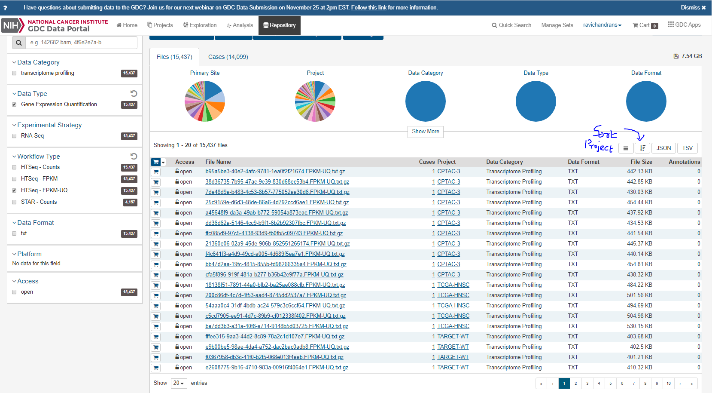
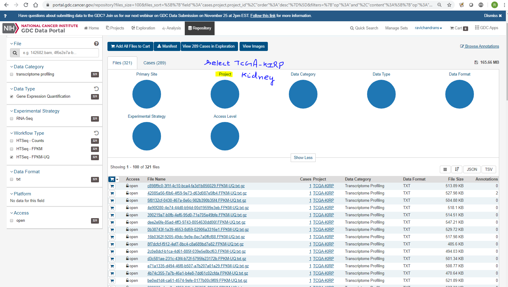
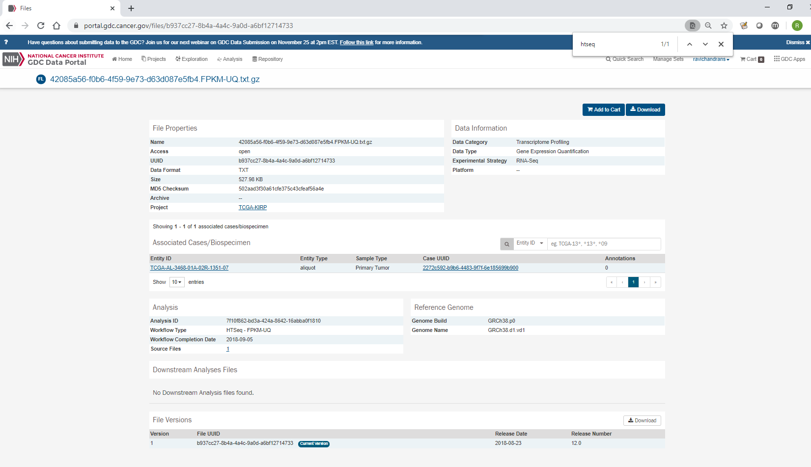
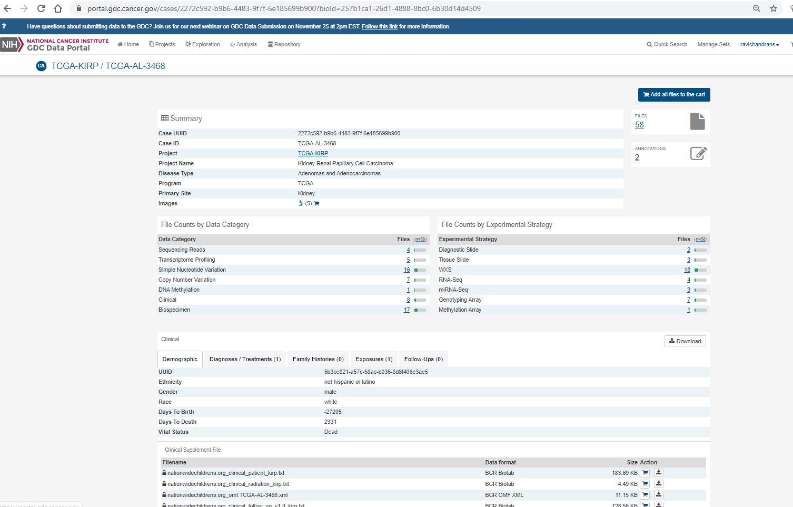
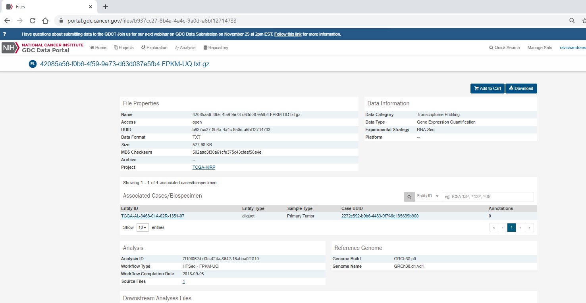
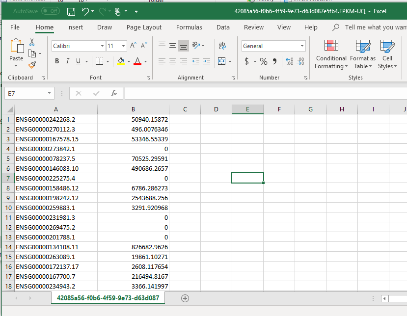
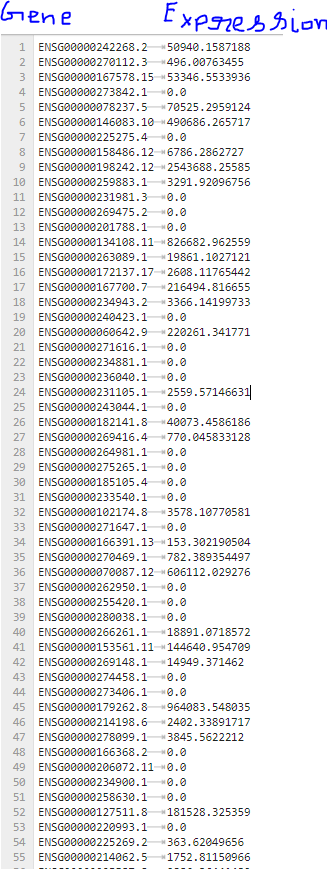

### Exploring Genomic Data Commons (https://gdc.cancer.gov/) to find expression data 
S. Ravichandran, PhD. 


```python
import pandas as pd
import numpy as np
import os
from IPython.core.display import Image
```

GDC is a comprehensive source for genomic data. Data download in bulk should be done via GDC tools. Before we start to download the data, we should 
explore the data-portal. In this tutorial, I will show how to manually explore GDC. For this tutorial, I will 
restrict my search to RNAseq expression data from one case in TCGA project, Cervical Kidney renal papillary cell carcinoma (KIRP).
Here are the steps: 





## Read the Training set data used for TC1 




















How can I save the RNAseq ID list from GDC? 

This file is called Manifest file. This following example shows how you can download the 
meta, clinical, manifest and other related files for a specific query (TCGA-KIRC in this case).
You can upload all the files to the card or you can click the Manifest link to download the manifest file. 


